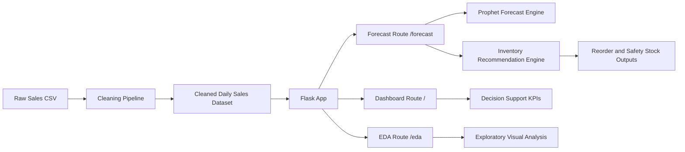

# Sales Forecasting & Inventory Optimization DSS

A practical Decision Support System (DSS) that helps retail decision-makers forecast demand and generate inventory recommendations using real sales data.

## 1. Problem Statement
Retail and supermarket managers often struggle with balancing stock availability and overstock risk. This system supports tactical decisions by:
- analyzing historical sales behavior,
- forecasting category-level demand,
- recommending reorder targets using reorder point and safety stock logic.

## 2. Decision-Makers and Decision Context
Primary decision-makers:
- Inventory managers
- Store operations managers
- Category managers

Decisions supported:
- Which categories should be reordered first
- How much stock should be reordered
- How demand is expected to change in the short term

## 3. DSS Theory and Decision Logic
This project combines multiple DSS components:
- Data-driven model: Prophet-based time-series forecasting for category demand.
- Rule-based logic: reorder recommendations using average demand, lead time, service level, and safety stock.
- KPI-based monitoring: revenue, quantity, and top-category metrics for management review.

Core formulas used:
- Reorder Point = Average Daily Demand x Lead Time
- Safety Stock = z x sigma_demand x sqrt(Lead Time)
- Target Stock = Reorder Point + Safety Stock

## 4. System Architecture


## 5. Data Source and Data Handling
Dataset files in this repository:
- `sales.csv` (raw transactional dataset)
- `sales_CLEANED.csv` (cleaned daily category-level data)
- `cleaned_monthly_sales.csv` (monthly aggregate)

Observed dataset scale:
- Raw rows: 286,392 lines (including header)
- Cleaned rows: 4,684 lines (including header)

Cleaning steps implemented in `cleaning.py`:
- Filter valid statuses (`received`, `complete`)
- Drop irrelevant/PII columns
- Remove missing values in essential fields
- Remove invalid qty/price values
- Convert dates to datetime
- Aggregate to category-date level
- Cap outliers per category
- Remove rare low-signal categories

## 6. Technologies Used
- Python 3
- Flask
- Pandas
- NumPy
- Prophet (forecasting)
- HTML/CSS/Chart.js (dashboard frontend)
- Pytest (test validation)

## 7. Features
- Home dashboard (`/`)
  - Revenue, profit, transactions, quantity KPIs
  - Top categories by units and revenue
  - DSS reorder recommendations table
- EDA dashboard (`/eda`)
  - Monthly trend charts
  - Weekday demand distribution
  - Top categories by quantity and revenue
- Forecast page (`/forecast`)
  - Category selection and forecast horizon
  - Future demand projections with confidence bounds
  - Inventory recommendation (reorder point, safety stock, target stock)

## 8. Installation and Run
### Prerequisites
- Python 3.10+ recommended

### Setup
```bash
python -m venv venv
venv\Scripts\activate
pip install -r requirements.txt
pip install pytest
```

### Run the app
```bash
python app.py
```
Then open:
- http://127.0.0.1:5000/
- http://127.0.0.1:5000/eda
- http://127.0.0.1:5000/forecast

### Run tests
```bash
python -m pytest -q
```

## 9. Repository Structure
```text
app.py
cleaning.py
python_clean_file.py
requirements.txt
sales.csv
sales_CLEANED.csv
cleaned_monthly_sales.csv
Templates/
  index.html
  eda.html
  forecast.html
  home.html
static/
  styles.css
tests/
  test_app.py
```

## 10. Screenshots
Add screenshots before submission:
- Home KPI dashboard
- EDA dashboard
- Forecast output + inventory recommendation

## 11. Team Members and Contributions
Update this section with your actual team details before final submission.

- Student 1: Data collection, cleaning pipeline, EDA preparation
- Student 2: Forecast model implementation, inventory decision logic
- Student 3: Flask integration, UI/dashboard, testing and documentation

## 12. Evaluation, Challenges, and Limitations
### Evaluation
- Functional DSS workflow from raw data to decision outputs
- Forecast and recommendation outputs generated interactively by category
- Basic automated tests for metric and data-loading logic

### Challenges
- Data quality and outliers in transactional records
- Balancing model complexity with interpretability for decision-makers
- Integrating forecasting outputs with practical inventory rules

### Limitations
- Current forecast is category-level (not SKU-level)
- Lead time and service level are currently fixed defaults in UI flow
- External factors (promotions, holidays, seasonality events) are not explicitly modeled

## 13. Conclusion and Recommendations
This project delivers a working DSS artifact that combines DSS theory, practical preprocessing, forecasting, and rule-based inventory recommendations. It can be extended by:
- adding scenario simulation for lead times and service levels,
- introducing SKU-level modeling,
- including richer exogenous variables for forecast improvement.
